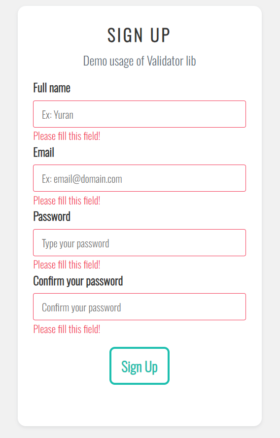
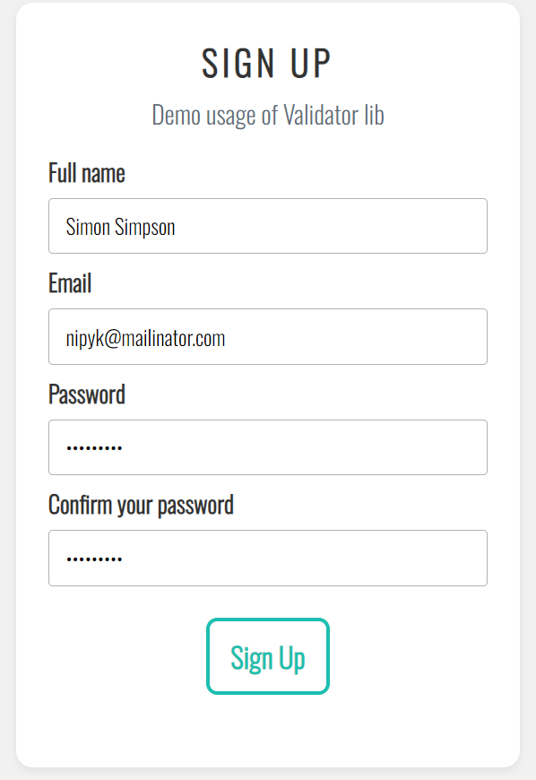

<h1 align="center">Form Validator</h1>
<p align="center" style="font-size:16px"><strong>A simple and easy to use validator for form!</strong></p>
<p align="center">  
  
</p>

<p align="center">
  
  
  
  
  
</p>

<div align="center"><a href="https://yuran1811.github.io/form-validator/" target="_blank">Live Demo</a></div>

## Screenshots

<div style="display:flex;gap:12px;justify-content:center">
	
	
</div>


## Usage

The form will look like this:

```html
<form id="form-id" class="form-container">
  <div class="form-group">
    <input type="" rules="" />
    <span class="form-message"></span>
  </div>

  <div class="form-group">
    <input type="" rules="" />
    <span class="form-message"></span>
  </div>
</form>
```

### Using the library

- Add the `script` tag after declare the `form`

```html
<script src="https://cdn.jsdelivr.net/gh/yuran1811/Form-Validator-Library@main/assets/yr_validator.js"></script>
```

- Handle the form like this

```js
let registForm = new Validator('#form-id');

// Use this if you don't want the form submit as default
registForm.onSubmit = (data) => console.log(data);
```

> **_Note:_** The span tag has class "form-message" contains the error message when the input is not matched the rules

### Detail usage

The input type can be any (text, checkbox, etc.)

The input rules will include these options:

```html
<!-- required: is used when the input field is mandatory -->
<input type="text" rules="required" />
```

```html
<!-- email: is used to check if the input value is an email address -->
<input type="text" rules="email" />
```

```html
<!-- min, max: are used to check if the input values have at least / at most any value -->
<input type="password" rules="min:6" />
<input type="password" rules="max:6" />
```

```html
<!-- confirmed: is used to confirm password -->
<input type="password" rules="confirmed" />
```

> **_Note:_** to apply more options for input rules, use "|" to split them all

```html
<input type="password" rules="required|min:6" />
```
